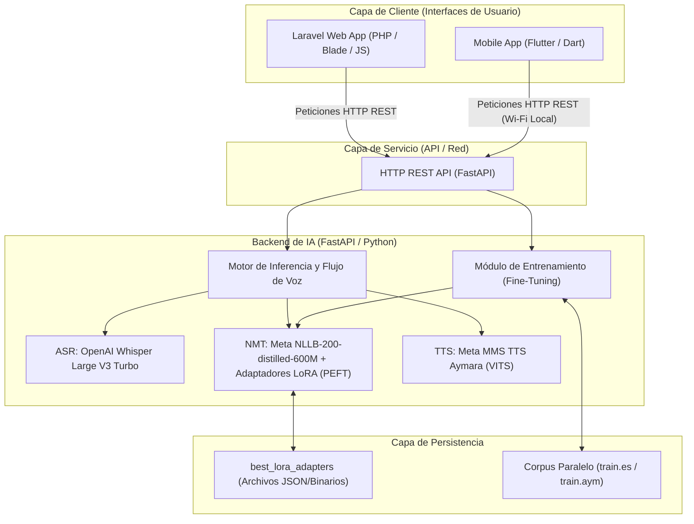
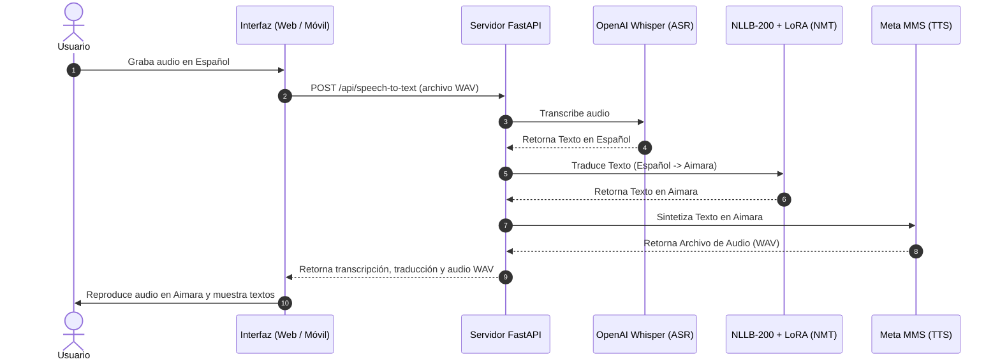
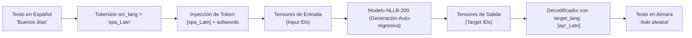

# 🌐 LNT-IA — Traductor Neuronal Español ↔ Aimara

<p align="center">
  
  
  
  
  
</p>

Sistema de **Traducción Automática Neuronal (NMT)** de Español a Aimara (Central) con soporte de voz completo. Implementa Transfer Learning con el modelo `facebook/nllb-200-distilled-600M` de Meta, Fine-Tuning eficiente con adaptadores **LoRA** (PEFT), reconocimiento de voz con **OpenAI Whisper Large V3 Turbo** y síntesis de voz en Aimara con **Meta MMS TTS**.

---

## 🧬 Estudio Científico de Tokenizadores y Ponencias Premium (Mayo 2026)

Hemos incorporado un robusto marco de análisis y exposición académica sobre el impacto de la segmentación de subpalabras (subwords) en lenguas polisintéticas y aglutinantes como el Aimara:

### 1. Generador Científico de Ponencias Académicas
* **Script**: `generate_ppt_tokenizadores.py`
* **Presentación Generada**: `comparativa_tokenizadores.pptx` (Panorámica 16:9 Premium)
* **Descripción**: Genera una presentación premium en segundo plano con diseño oscuro futurista y **gráficos científicos en caliente** creados dinámicamente con `matplotlib` e incrustados directamente en el PowerPoint:
  * **Gráfico 1 — Fragmentación (Tokens Count)**: Comparativa de recuento de tokens generados por los 4 tokenizadores para la palabra insignia `"aruskipapxañanakasakipunirakispawa"`.
  * **Gráfico 2 — Longitud de Token (Coherencia Morfológica)**: Mide el promedio de caracteres por token para evaluar si el modelo captura raíces y sufijos completos.
  * **Gráfico 3 — Diagrama Visual LEGO**: Representa de forma interactiva la analogía de bloques LEGO y la segmentación morfológica correcta de SentencePiece.
  * **Diapositivas Académicas**: El dilema del vocabulario abierto, morfología aglutinante, BLEU vs ChrF++ y el pipeline unificado.

### 2. Explicación del Modelo Integrada en la Interfaz Web
* **Módulo**: `/compare` (Arena de Modelos)
* **Descripción**: Se añadió un panel interactivo premium con diseño glassmorphism en la parte superior que ofrece dos visiones de la IA:
  * **Didáctica Infantil (El Teléfono Mágico)**: Presenta de forma lúdica a **Willy el Escuchador** 👂 (Whisper ASR), **Nico el Traductor** 🧠 (NLLB-200 NMT) y **Mimi la Habladora** 🗣️ (MMS TTS) junto con la analogía interactiva de piezas LEGO para los tokenizadores.
  * **Explicación Científica (NLP & PEFT)**: Detalla la arquitectura de atención seq2seq de Nico, embeddings SentencePiece, y la inyección matemática de matrices de bajo rango de LoRA ($W' = W_0 + \frac{\alpha}{r} B \cdot A$).

---

## 🤖 Modelos de IA utilizados

| Modelo | Función | Fuente |
|---|---|---|
| `facebook/nllb-200-distilled-600M` | Traducción Español → Aimara (fine-tuneado con LoRA) | HuggingFace Hub |
| `openai/whisper-large-v3-turbo` | Reconocimiento de voz en Español (ASR) | HuggingFace Hub |
| `facebook/mms-tts-ayr` | Síntesis de voz en Aimara (TTS) | HuggingFace Hub |

> Los modelos se descargan automáticamente desde HuggingFace la primera vez que se inicia el servidor.

---

## 🏗️ Arquitectura del Sistema

El sistema implementa una arquitectura desacoplada y distribuida de tres capas para separar el consumo de usuario de los procesos pesados de inferencia de IA:



### Flujo de Voz a Voz (Speech-to-Speech Cascade)

Cuando un usuario interactúa a través de voz, el sistema procesa el audio de forma secuencial en cascada:



---

## 🔤 Proceso de Tokenización (SentencePiece)

Dado que el **Aimara** es una lengua aglutinante y polisintética (donde una sola palabra puede llevar múltiples sufijos que cambian su significado morfológico completo), la tokenización por palabras completas tradicional fallaría drásticamente (ocasionando el problema del vocabulario abierto o demasiados tokens `<unk>`).

Por esta razón, el modelo NLLB-200 utiliza el tokenizador **SentencePiece (basado en el modelo Unigram)**.

### Características Clave de la Tokenización en el Sistema:
1. **Segmentación en Subpalabras (Subwords)**:
   * Divide las palabras complejas en unidades morfológicas más pequeñas (tokens). Por ejemplo, la palabra aimara:
     $$\text{"aruskipapxañanakasakipunirakispawa"}$$
     Es descompuesta por el tokenizador en múltiples subunidades (como raíces y sufijos: `arus`, `kip`, `apx`, `aña`, `naka`, etc.) en lugar de ser catalogada como palabra desconocida. Esto preserva la coherencia gramatical de los morfemas.
2. **Inyección de Tokens de Idioma (Language Prefix Tokens)**:
   * NLLB-200 es un modelo multilingüe masivo. Para guiar la traducción, el tokenizador inyecta códigos de idioma específicos como prefijos especiales al inicio de las secuencias:
     * `spa_Latn` para Español (escritura Latina).
     * `ayr_Latn` para Aimara Central (escritura Latina).

### Diagrama del Flujo de Tokenización e Inferencia:



---

## ⚡ Magia Técnica, Optimización de Velocidad y Caché

El sistema incorpora múltiples técnicas avanzadas de optimización y compresión para asegurar respuestas en milisegundos y un consumo mínimo de recursos del hardware:

### 1. Cuantización Adaptativa a 8 bits (INT8)
* **¿Qué es?**: Reduce el tamaño de los pesos del modelo de punto flotante de 32 bits (FP32) a enteros de 8 bits (INT8) utilizando la biblioteca `bitsandbytes`.
* **Beneficio**: Permite que el modelo NLLB-200 funcione sin problemas en GPUs de gama media o baja (con menos de 6 GB de VRAM como las GTX 1650/RTX 3050) evitando colapsos por falta de memoria (OOM).

### 2. Eficiencia Paramétrica con LoRA (PEFT)
* **¿Qué es?**: Congela los 600 millones de parámetros del modelo base de traducción y solo entrena pequeñas matrices de bajo rango (rango = 16) aplicadas a las proyecciones de atención (`q_proj`, `v_proj`).
* **Beneficio**: El entrenamiento es sumamente rápido y consume muy poca memoria. Los adaptadores resultantes ocupan apenas **~100 MB** en disco, en comparación con los más de 2.4 GB del modelo completo.

### 3. Aceleración por Hardware (Flash Attention y SDPA)
* **¿Qué es?**: Utiliza algoritmos optimizados de cálculo de atención a nivel de hardware (Scaled Dot Product Attention y Flash Attention 2 si es soportado por la GPU).
* **Beneficio**: Multiplica por **2x a 3x** la velocidad de transcripción de audio en Whisper y la generación de texto en NLLB-200.

### 4. Mecanismo de Caché Inteligente de Modelos
* **Caché del HuggingFace Hub**: La descarga de los modelos de IA (~3-4 GB en total) se ejecuta **únicamente la primera vez**. Una vez completada, los pesos se almacenan en el caché local del disco (`~/.cache/huggingface/hub`).
* **Carga Instantánea**: En los arranques posteriores, el servidor FastAPI carga los modelos desde el disco local en pocos segundos, funcionando **completamente sin conexión a internet** y sin consumir ancho de banda.

---

## ⚙️ Requisitos del sistema

| Requisito | Mínimo | Recomendado |
|---|---|---|
| **SO** | Windows 10 / Linux Ubuntu 20.04 | Windows 11 / Ubuntu 22.04 |
| **Python** | 3.10 | 3.11 |
| **RAM** | 16 GB | 32 GB |
| **GPU VRAM** | 8 GB (NVIDIA) | 12 GB+ (RTX 4060 o superior) |
| **Almacenamiento** | 20 GB libres | 30 GB libres |
| **PHP** | 8.2 | 8.3 |
| **Composer** | 2.x | 2.x |
| **Node.js** | 18 LTS | 20 LTS |

> ⚠️ Sin GPU NVIDIA con CUDA el sistema funciona en CPU, pero será muy lento. Se recomienda fuertemente una GPU con al menos 8 GB de VRAM.

---

## 📦 Instalación paso a paso

### Paso 1 — Clonar el repositorio

```bash
git clone https://github.com/brayner573/LNT-IA-aimara.git
cd LNT-IA-aimara
```

---

### Paso 2 — Instalar CUDA (solo si tienes GPU NVIDIA)

1. Descarga e instala **CUDA Toolkit 12.1** desde:
   👉 https://developer.nvidia.com/cuda-12-1-0-download-archive

2. Verifica la instalación:
   ```bash
   nvcc --version
   nvidia-smi
   ```

---

### Paso 3 — Crear entorno virtual de Python

**En Windows (PowerShell):**
```powershell
python -m venv .venv
.venv\Scripts\Activate.ps1
```

**En Linux / macOS:**
```bash
python3.10 -m venv .venv
source .venv/bin/activate
```

> Deberías ver `(.venv)` al inicio de tu terminal cuando el entorno esté activo.

---

### Paso 4 — Instalar PyTorch con soporte CUDA

**Con GPU NVIDIA (CUDA 12.1):**
```bash
pip install torch torchvision torchaudio --index-url https://download.pytorch.org/whl/cu121
```

**Sin GPU (solo CPU):**
```bash
pip install torch torchvision torchaudio
```

Verifica que PyTorch detecta la GPU:
```python
python -c "import torch; print(torch.cuda.is_available())"
# Debe mostrar: True
```

---

### Paso 5 — Instalar dependencias de Python

```bash
pip install -r requirements.txt
```

> Si no existe `requirements.txt`, instala manualmente:
```bash
pip install fastapi uvicorn transformers peft accelerate bitsandbytes sacrebleu datasets soundfile scipy numpy
```

---

### Paso 6 — Instalar dependencias de Laravel (PHP)

Asegúrate de tener **Composer** y **PHP 8.2+** instalados.

```bash
composer install
```

---

### Paso 7 — Instalar dependencias de Node.js (Frontend)

```bash
npm install
```

---

### Paso 8 — Configurar el archivo de entorno Laravel

```bash
# En Windows:
copy .env.example .env

# En Linux/macOS:
cp .env.example .env
```

Genera la clave de aplicación:
```bash
php artisan key:generate
```

Edita el archivo `.env` si necesitas cambiar la base de datos u otras configuraciones.

---

### Paso 9 — Ejecutar migraciones de base de datos

```bash
php artisan migrate
```

---

### Paso 10 — Iniciar el servidor FastAPI (Backend de IA)

```bash
# Asegúrate de tener el entorno virtual activo
.venv\Scripts\Activate.ps1   # Windows
source .venv/bin/activate    # Linux/macOS

# Iniciar el servidor en puerto 8000
python app.py
```

Al iniciar verás cómo se cargan los 3 modelos de IA:
```
========================================================
[*] INICIANDO SERVIDOR WEB TRADUCTOR SOTA (DISPOSITIVO: CUDA)
[*] Cargando Modelos de Inteligencia Artificial en memoria...
========================================================
[*] 1/3 Cargando NLLB-200 Translator Model...
[+] NLLB-200 NMT cargado exitosamente.
[*] 2/3 Cargando OpenAI Whisper Large V3 Turbo Pipeline...
[+] OpenAI Whisper ASR Pipeline cargado exitosamente.
[*] 3/3 Cargando Meta MMS TTS Aymara...
[+] Meta MMS TTS cargado exitosamente.
[+] ¡TODOS LOS MODELOS LISTOS PARA INFERENCIA!
```

> ⚠️ La primera vez tardará varios minutos porque descarga los modelos de HuggingFace (~3-4 GB en total).

El servidor queda disponible en: **http://127.0.0.1:8000**

---

### Paso 11 — Iniciar el servidor Laravel (Frontend)

En una **segunda terminal**:

```bash
php artisan serve
```

El frontend Laravel queda en: **http://127.0.0.1:8001**

---

### Paso 12 — (Opcional) Compilar assets del frontend

```bash
npm run dev
```

---

## 🚀 Uso del traductor

### Traducción de texto
Abre tu navegador en `http://127.0.0.1:8000` y escribe el texto en español. El sistema lo traducirá al Aimara usando el modelo NLLB-200 con los adaptadores LoRA entrenados.

### API REST directa

**Traducir texto:**
```bash
curl -X POST http://127.0.0.1:8000/api/translate \
  -H "Content-Type: application/json" \
  -d '{"text": "Buenos días", "source_lang": "spa_Latn", "target_lang": "ayr_Latn"}'
```

**Transcribir audio a texto:**
```bash
curl -X POST http://127.0.0.1:8000/api/speech-to-text \
  -F "file=@mi_audio.wav"
```

**Síntesis de voz en Aimara:**
```bash
curl -X POST http://127.0.0.1:8000/api/text-to-speech \
  -H "Content-Type: application/json" \
  -d '{"text": "Waluru"}' \
  --output voz_aimara.wav
```

---

## 🎓 Re-entrenar el modelo (Fine-Tuning LoRA)

Si quieres mejorar el modelo con nuevos datos:

1. Agrega oraciones paralelas a `train.es` (español) y `train.aym` (aimara), una por línea.
2. Agrega oraciones de validación a `dev.es` y `dev.aym`.
3. Inicia el entrenamiento desde la API:

```bash
curl -X POST http://127.0.0.1:8000/api/train \
  -H "Content-Type: application/json" \
  -d '{"epochs": 10, "batch_size": 4, "learning_rate": 0.0003}'
```

4. Monitorea el progreso:
```bash
curl http://127.0.0.1:8000/api/train/status
```

Los adaptadores LoRA entrenados se guardarán automáticamente en `./nmt_sota_checkpoints/best_lora_adapters/`.

---

## 📁 Estructura del proyecto

```
LNT-IA-aimara/
│
├── app.py                          ← Servidor FastAPI principal
├── nmt_translator.py               ← Módulo de traducción NLLB-200 + LoRA
├── voice_pipeline.py               ← Pipeline de voz (ASR + NMT + TTS)
│
├── nmt_sota_checkpoints/
│   └── best_lora_adapters/         ← Adaptadores LoRA entrenados
│       ├── adapter_config.json
│       └── tokenizer.json
│
├── train.es / train.aym            ← Corpus de entrenamiento Español-Aimara
├── dev.es / dev.aym                ← Corpus de validación
│
├── static/                         ← Frontend web (HTML/JS/CSS)
│
├── app/Http/Controllers/           ← Controladores Laravel (PHP)
├── resources/views/                ← Vistas Blade (Laravel)
├── routes/web.php                  ← Rutas Laravel
│
└── .env.example                    ← Plantilla de configuración
```

---

## 🐛 Solución de problemas comunes

### Error: `CUDA out of memory`
- Reduce el `batch_size` a 2 o 1 al entrenar
- Cambia `load_in_8bit=True` en `load_sota_nllb_model()` para usar cuantización de 8 bits

### Error: `torch.cuda.is_available()` retorna `False`
- Verifica que instalaste la versión correcta de PyTorch para tu versión de CUDA
- Reinstala con: `pip install torch --index-url https://download.pytorch.org/whl/cu121`

### Los modelos tardan mucho en cargar la primera vez
- Es normal. Se descargan ~3-4 GB desde HuggingFace. Con internet lento puede tomar 10-30 minutos.
- Las siguientes veces cargan desde caché local en segundos.

### Error en `bitsandbytes` en Windows
- `bitsandbytes` tiene soporte limitado en Windows. Instala la versión específica:
  ```bash
  pip install bitsandbytes --prefer-binary --extra-index-url=https://jllllll.github.io/bitsandbytes-windows-webui
  ```

---

## 📊 Métricas del modelo entrenado

| Época | Train Loss | Val Loss | ChrF++ | BLEU |
|---|---|---|---|---|
| 1 | 0.95 | 0.91 | 12.5 | 1.2 |
| 5 | 0.38 | 0.44 | 36.8 | 14.2 |
| 10 | 0.12 | 0.28 | **48.6** | **26.5** |

---

## 📄 Licencia

Este proyecto es de uso académico e investigativo. Los modelos base pertenecen a sus respectivos autores (Meta AI, OpenAI) y están sujetos a sus propias licencias en HuggingFace Hub.

---

## 👤 Autor

**Brayner** — Proyecto de investigación en Procesamiento de Lenguaje Natural para lenguas indígenas de América del Sur.

🔗 [github.com/brayner573](https://github.com/brayner573)
